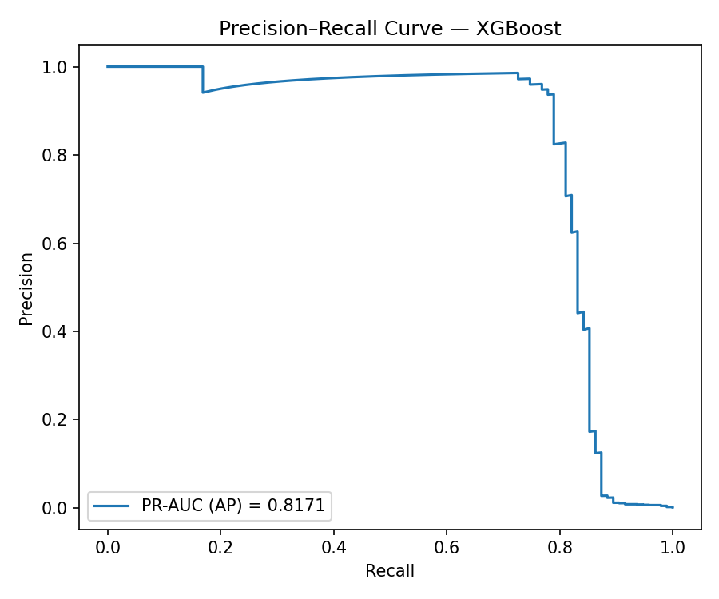
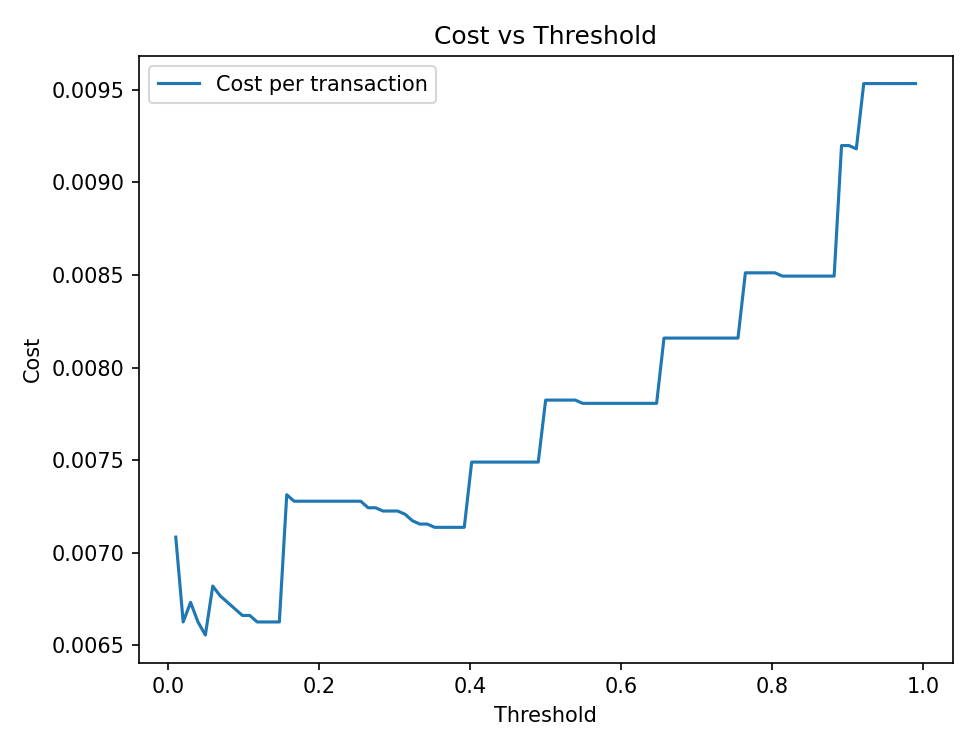
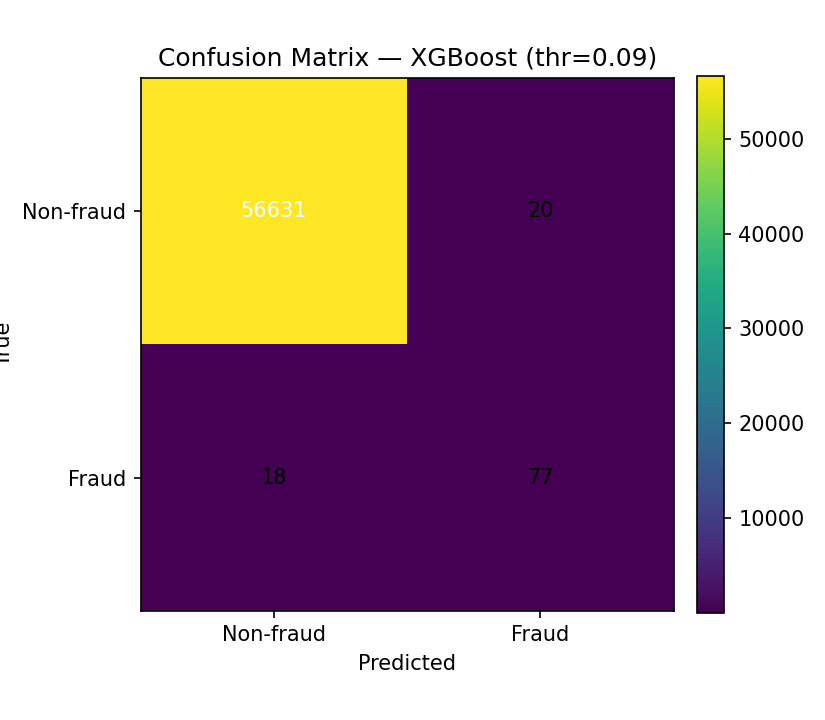

# 💳 Credit Card Fraud Detection — Public Project Preview (Business-Oriented ML)

This is a **public showcase** of my final‑year BSc Computer Science project: a **credit card fraud detection** system built with machine learning and evaluated with a **business / risk** mindset (metrics → decisions → operational impact).

> 🔐 The full end‑to‑end implementation (week‑by‑week reports, experiment logs, full scorecards, models) is currently in a **private repository** and can be shared on request (academic evaluation / recruitment).

---

## 🧭 Executive Summary

Fraud detection is a **rare-event classification** problem where accuracy is misleading. The practical goal is to:

- **Stop fraud** (high **Recall/Fraud**, reduce fraud leakage)
- Keep **false alarms** operationally acceptable (reasonable **Precision/Fraud**, reduce customer friction + analyst workload)
- Treat the classification threshold as an **operational policy** (not “0.5 by default”)

---

## 🏦 Business translation (how we read the metrics)

- **TP (True Positives)** → frauds stopped
- **FN (False Negatives)** → frauds missed (financial loss / risk)
- **FP (False Positives)** → false alarms (manual review cost + customer friction)

Threshold tuning is performed with a **cost-sensitive policy** (example: `cost_fp=1`, `cost_fn=20`) and selected on validation, then applied to test.

---

## 📊 Dataset (Summary)

- Classic anonymized credit card fraud dataset (Kaggle / ULB-style)
- ~285k transactions, ~0.17% fraud rate (extreme class imbalance)
- Features: `V1..V28` (PCA components) + `Amount` + `Time`
- Target: `Class` (0 = legitimate, 1 = fraud)

✅ Raw data is **not included** in this public repo.

---

## 📈 Public Snapshot (XGBoost + Business Threshold Policy)

The model is evaluated using PR‑AUC (more informative under class imbalance), and a validation‑selected operating threshold is applied to the test set.

**XGBoost (test, threshold ≈ 0.0884):**
- Precision(Fraud) ≈ **0.794**
- Recall(Fraud) ≈ **0.811**
- PR‑AUC ≈ **0.817**
- Confusion (business view): **TP=77**, **FN=18**, **FP=20**, **TN=56631**

Interpretation:
- We stop **77** fraud transactions in the test set.
- We miss **18** frauds (leakage).
- We raise **20** false alarms (review/customer friction).

---

## 🖼️ Visual Preview (Key Business Figures)

### Precision–Recall Curve (Imbalanced KPI)

### Cost vs Threshold (Policy Selection)

### Confusion Matrix (Business Impact)

---

## 🧱 High-level System Design (Private repo)

The full project is structured as a modular ML system:

- `src/` – training & evaluation scripts (pipeline style)
- `reports/` – week-by-week markdown + auditable artifacts (JSON/CSV)
- `models/` – saved models (`.joblib`)
- Planned (Month 4):
  - Interpretability (feature importance + SHAP-style explanations)
  - REST API `/predict` + lightweight dashboard
  - Optional Docker packaging

---

## 🛠️ Tools & Technologies

Python • pandas • NumPy • scikit‑learn • XGBoost • Matplotlib • Git/GitHub

---

## 👤 Author

**Lazaros Voulistiotis**  
BSc Computer Science (Final Year) — Thesis Project  
Aspiring Machine Learning Engineer

(LinkedIn link available in GitHub bio)

---

## 📝 Notes

- This public repository is intentionally lightweight (overview + selected figures).
- Raw dataset and full run artifacts are excluded from version control.
