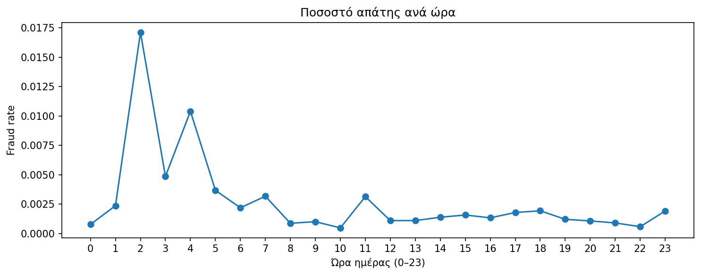
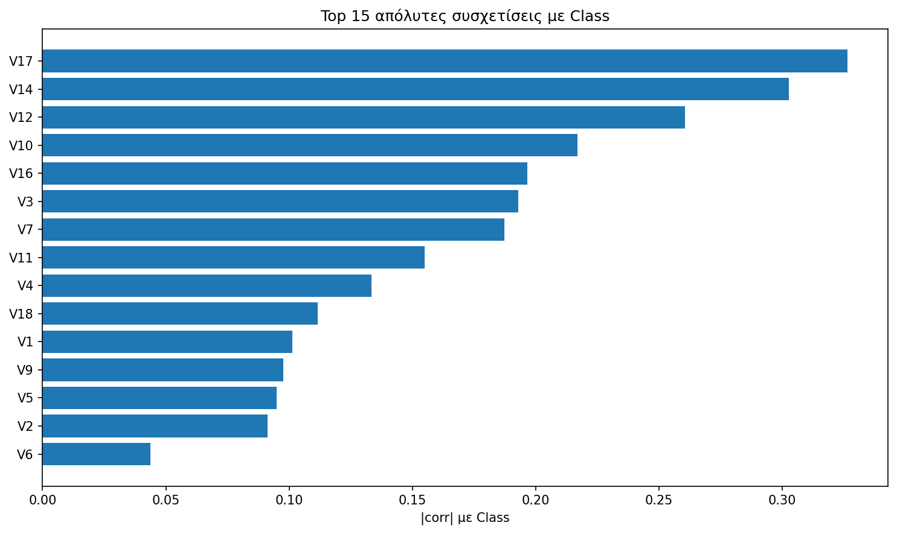
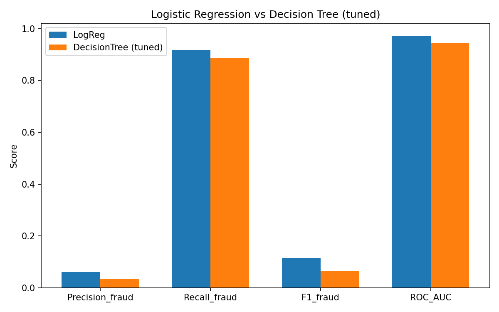
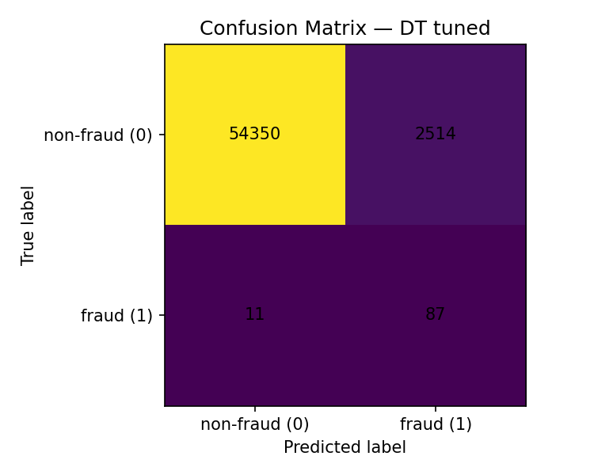
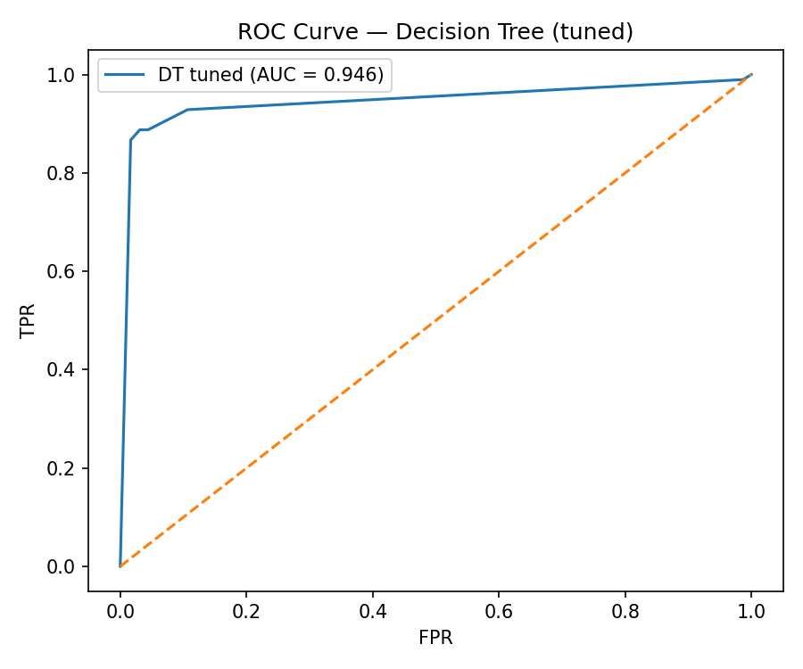
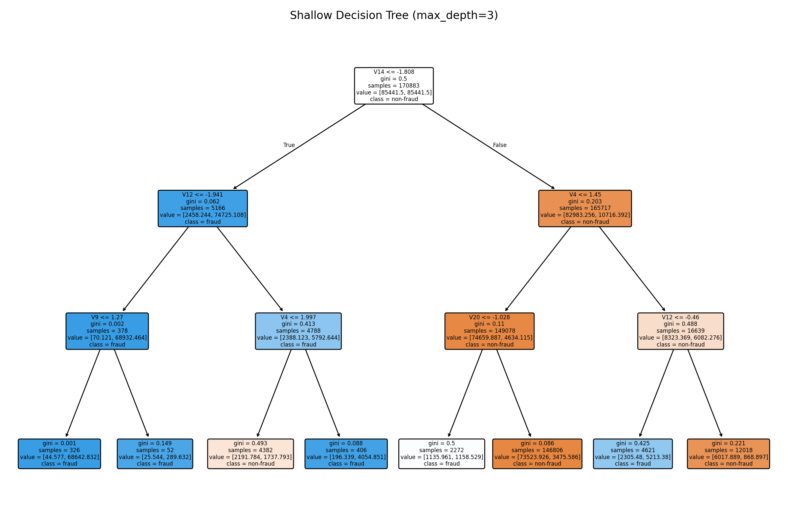

# 💳 Credit Card Fraud Detection – Project Overview

This repository provides a **public overview** of my final-year BSc Computer Science project:
a **credit card fraud detection system** built with machine learning, focused on **business impact** and **real-world workflows**.

> 🔐 The full codebase, detailed reports and experiment history are stored in a **private repository** and are available upon request (e.g. for academic evaluation or recruitment purposes).

---

## 🧭 Executive Summary

The goal of the project is to build a machine learning pipeline that helps a bank:

- Detect **fraudulent credit card transactions** early
- Maximize **recall on fraud cases (Class = 1)**  
- Keep **false positives** at a manageable, business-acceptable level
- Provide **interpretable outputs** that fraud analysts and risk teams can trust

The system is designed as if it were to be deployed in a **production environment**  
(REST API + basic dashboard, container-ready).

---

## 🏦 Business Problem & Objectives

Credit card fraud has a very low frequency but a **disproportionately high financial impact**  
(chargebacks, investigations, reputational damage).

**Key business question:**

> Can we design an ML model that catches most fraud cases  
> without overwhelming analysts and customers with false alarms?

**Objectives:**

- High **recall** on fraud cases  
- Controlled **false positive rate**  
- Explainable logic for risk/fraud teams  
- Reproducible, extensible code structure (ML pipeline → API → dashboard)

---

## 📊 Dataset (Summary)

- Public anonymized dataset from real credit card transactions  
- ~285k transactions, ~0.17% fraud rate (high class imbalance)
- Features:
  - PCA-transformed components (`V1`–`V28`)
  - `Amount`, `Time`
  - `Class` (0 = legitimate, 1 = fraud)

Raw data is **not** stored in this public repo.

---

## 🔬 Approach & Methods

The modelling approach follows a **step-by-step, production-inspired pipeline**:

- Baseline models:
  - **Logistic Regression**
  - **Decision Tree Classifier**
- Imbalanced data handling:
  - Class weights
  - Oversampling (e.g. SMOTE – in experiments)
- Planned / ongoing:
  - **Random Forest**, **Gradient Boosting**
  - Threshold tuning based on business trade-offs
  - Model explainability (e.g. feature importance, SHAP-style analysis)

---

## 📈 Key Results (Snapshot)

📌 This section will be continuously updated as experiments progress.  

The table below shows an **indicative snapshot** of selected models (using current experiments):

| Model                      | Recall (Fraud) | Precision (Fraud) | ROC-AUC | Notes                           |
|----------------------------|----------------|--------------------|--------|---------------------------------|
| Logistic Regression        | …              | …                  | …      | Baseline linear model           |
| Decision Tree (tuned)      | …              | …                  | …      | Non-linear, interpretable rules |

🔎 Full experiment history, additional models and week-by-week analysis are documented in the private repository  
(reports, notebooks and JSON metrics).

---

## 📊 Visual Preview

Selected visual outputs from the project, from data understanding to model performance and interpretability.

### Data insights

*Fraud rate per hour of day. Night-time hours (around 02:00–04:00) show a much higher fraud rate, suggesting time-aware fraud strategies (stricter rules at night, softer during daytime).*

*Top 15 features ranked by absolute Pearson correlation with the fraud label (`Class`). These variables are prioritised in early experimentation and cross-checked later with model-based importance.*

---

### Model comparison & performance

*Side-by-side comparison of key fraud metrics (precision, recall, F1 for fraud class and ROC-AUC) between the Logistic Regression baseline and the tuned Decision Tree model.*

*Confusion matrix for the tuned Decision Tree on the test set, highlighting the trade-off between detected fraud (TP), missed fraud (FN) and false positives.*

*ROC curve for the tuned Decision Tree model (AUC ≈ 0.95), showing strong separation between fraud and non-fraud classes.*

---

### Model interpretability

*A shallow Decision Tree (max_depth=3) illustrating example decision rules and thresholds that can be inspected and discussed with fraud analysts and risk stakeholders.*

---

## 🧱 System Design (High-level)

The full project (private repo) is structured as a **modular ML system**:

- `notebooks/` – research & experimentation (EDA, model development)
- `src/` – reusable, production-like Python modules  
  (data loading, preprocessing, training, evaluation)
- `models/` – serialized models ready for serving (e.g. `.joblib`)
- `reports/` – markdown reports that align with thesis chapters
- Planned:
  - REST API endpoint `/predict` for scoring transactions
  - Simple dashboard for analysts (Streamlit or Flask-based)
  - Containerization (Docker) and cloud deployment demo

---

## 🛠️ Tools & Technologies

- **Language:** Python  
- **Libraries:** scikit-learn, NumPy, pandas, Matplotlib/Seaborn  
- **Experimentation:** Jupyter Notebooks  
- **Version control:** Git & GitHub  
- **Project management:** Trello (Kanban – To Do / In Progress / Done)  
- **Planned deployment:** FastAPI/Flask + Docker + cloud hosting

---

## 🎓 Learning & Certifications (selected)

As part of this project, I am systematically building my skills in ML and MLOps through online courses:

- Supervised Machine Learning: Regression & Classification – *Coursera (Stanford / DeepLearning.AI)*
- Data Science with Python – *Great Learning Academy*
- Machine Learning with Python (Digital Badge) – *IBM Cognitive Class*
- Kaggle micro-courses – *Python, Pandas, Data Visualization, Intermediate ML, Feature Engineering*
- Docker, cloud and deployment courses (AWS / IBM / Microsoft, etc.)

These are referenced in the thesis as **evidence of structured, industry-relevant learning**.

---

## 👤 Author & Contact

**Lazaros Voulistiotis**  
BSc Computer Science (Final Year)  
Aspiring Machine Learning Engineer 

- LinkedIn: *[Lazaros Voulistiotis](https://www.linkedin.com/in/lazaros-voulistiotis/)*   

💡 *Full code and technical documentation are available on request  
(in a private GitHub repository used for my thesis and academic evaluation).*
