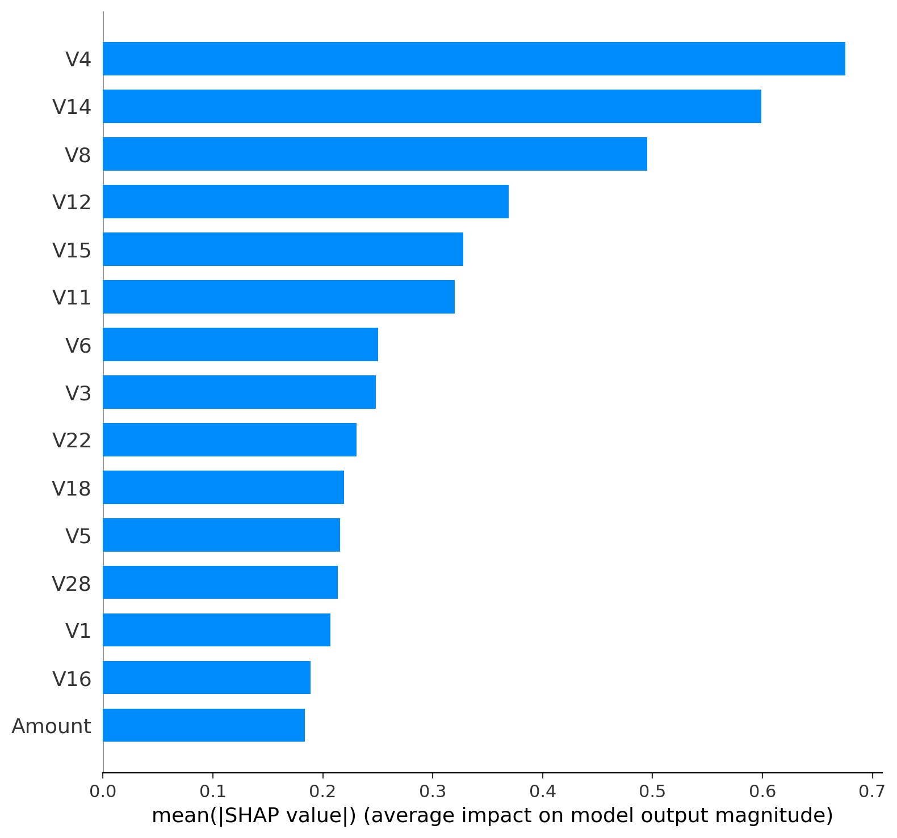

# 💳 Credit Card Fraud Detection — Public Project Overview (Business‑Oriented ML)

This is a **public showcase** of my final‑year BSc Computer Science thesis project: a **credit card fraud detection** system built with machine learning and evaluated with a **business / risk** mindset (metrics → decisions → operational impact).

> 🔐 The full end‑to‑end implementation (week‑by‑week reports, experiment logs, model artifacts) lives in a separate repository and can be shared on request (academic evaluation / recruitment).

---

## 🧭 Executive Summary

Fraud detection is a **rare‑event classification** problem where accuracy is misleading. The practical goal is to:

- **Stop fraud** (high **Recall/Fraud**, reduce fraud leakage)
- Keep **false alarms** operationally acceptable (reasonable **Precision/Fraud**, reduce customer friction + analyst workload)
- Treat the probability threshold as an **operational policy** (not “0.5 by default”)

**Current champion model:** **XGBoost** (tree‑based gradient boosting) with a **cost‑optimised threshold** selected on validation and applied once on the locked test set.

---

## 📊 Dataset

Kaggle “Credit Card Fraud Detection”: **284,807** transactions over two days, **492 frauds (~0.17%)**.  
Features: anonymised PCA components **V1…V28** plus **Time** and **Amount**.

**Why this matters:** with such imbalance, you must rely on **PR‑AUC**, **cost‑based thresholding**, and careful validation/testing.

---

## 🏦 Business translation (how we read the metrics)

- **TP (True Positives)** → frauds stopped
- **FN (False Negatives)** → frauds missed (direct loss / risk)
- **FP (False Positives)** → false alarms (manual review cost + customer friction)

We therefore optimise and report results using an explicit cost policy:

- `cost_fp = 1`
- `cost_fn = 20`

---

## ✅ Results snapshot (locked test set)

**Operating threshold (val‑selected, cost‑optimal):** **0.0884**  
At this operating point:

- **TP = 77**, **FP = 20**, **FN = 18**, **TN = 56,631**
- **Precision(Fraud) = 0.7938**, **Recall(Fraud) = 0.8105**
- **PR‑AUC (AP) = 0.8171**

This is a strong, business‑friendly trade‑off: we catch most fraud while keeping false alarms low.

---

## 📈 Key Figures (recommended for the public overview)

### 1) Confusion Matrix (XGBoost at thr ≈ 0.09)

### 2) Cost vs Threshold (why thr=0.0884)

### 3) Precision–Recall Curve (PR‑AUC)

---

## 🔍 Explainability (Week 15 — SHAP)

To make the model **auditable and responsible**, SHAP (TreeExplainer) was applied to the champion XGBoost model.

**Global drivers (mean |SHAP|):** V4, V14, V8, V12, V15, V11, …  
**Local case studies:**  
- **True Positive** (very high fraud probability)  
- **True Negative** (near‑zero fraud probability)  
- **Borderline** case near the operating threshold **0.0884**

---

## 🗂️ Project structure (overview)

- `src/` — scripts for data splitting, training, evaluation, explainability
- `models/` — saved model artifacts (joblib)
- `reports/` — weekly write‑ups + metrics/sweeps (full repo)
- `assets/` — **(this repo)** selected figures for the public overview

---

## ⚡ Reproducibility (high level)

1. Download `creditcard.csv` from Kaggle (not committed due to licensing).
2. Create stratified train/val/test splits (seeded).
3. Train and evaluate models (LogReg → Decision Tree → Random Forest → XGBoost).
4. Select threshold on validation using cost policy; apply once on locked test.
5. Run SHAP for global + local explanations.

---

## 👤 Author

**Lazaros Voulistiotis** — final‑year Computer Science student, aspiring Machine Learning Engineer.

---
