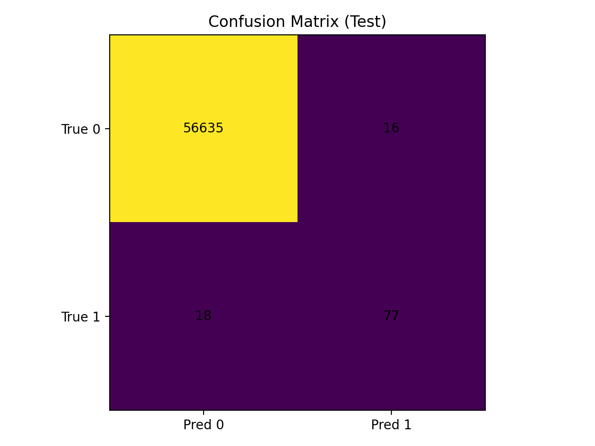
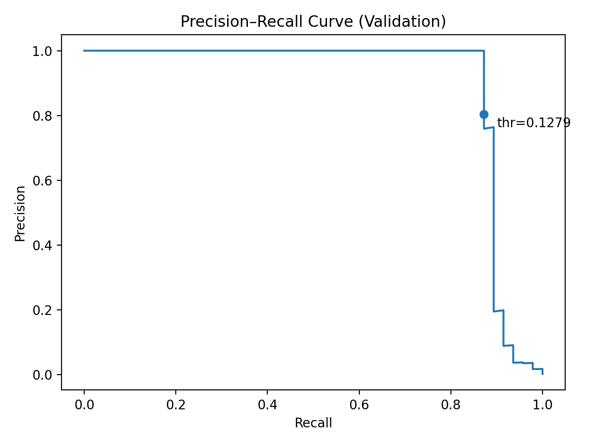
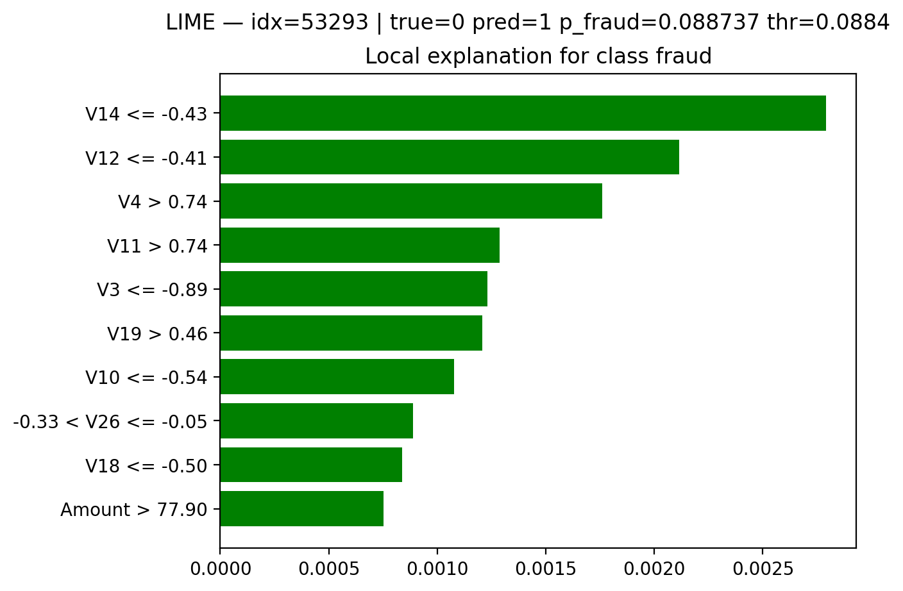

# 💳 Credit Card Fraud Detection — Public Project Overview (Business‑Oriented ML)

This is a **public showcase** of my final‑year BSc Computer Science thesis project: a **credit card fraud detection** system built with machine learning and evaluated with a **business / risk** mindset (metrics → decisions → operational impact).

> 🔐 The full end‑to‑end implementation (week‑by‑week reports, experiment logs, model artifacts) lives in a separate repository and can be shared on request (academic evaluation / recruitment).

---

## 🧭 Executive Summary

Fraud detection is a **rare‑event classification** problem where accuracy is misleading. The practical goal is to:

- **Stop fraud** (high **Recall/Fraud**, reduce fraud leakage)
- Keep **false alarms** operationally acceptable (high **Precision/Fraud**, reduce customer friction + analyst workload)
- Treat the probability threshold as an **operational policy** (not “0.5 by default”)

**Current champion model:** **XGBoost** (tree‑based gradient boosting).  
**Final operating policy (Month 4):** **precision constraint** (**precision ≥ 0.80**) selected on validation and applied once on the locked test set.

---

## 📊 Dataset

Kaggle “Credit Card Fraud Detection”: **284,807** transactions over two days, **492 frauds (~0.17%)**.  
Features: anonymised PCA components **V1…V28** plus **Time** and **Amount**.

**Why this matters:** with such imbalance, you must rely on **PR‑AUC**, robust validation/testing, and a threshold policy aligned with operational constraints.

---

## 🏦 Business translation (how we read the metrics)

- **TP (True Positives)** → frauds stopped
- **FN (False Negatives)** → frauds missed (direct loss / risk)
- **FP (False Positives)** → false alarms (manual review cost + customer friction)

Instead of a default 0.5 threshold, the project treats the threshold as a **deployment decision**. During Month 4 we evaluated multiple policies (cost‑based, max‑F metrics, precision constraint) and **locked** the final policy below.

---

## ✅ Results snapshot (locked test set)

**Final operating policy:** `precision_constraint_p80` (precision ≥ 0.80)  
**Selected threshold (validation):** **0.1279**  
**Reported once on locked test set:**

- **TP = 77**, **FP = 16**, **FN = 18**, **TN = 56,635**
- **Precision(Fraud) = 0.8280**, **Recall(Fraud) = 0.8105**
- **F1 = 0.8191**, **F2 = 0.8140**
- **MCC = 0.8189** (strong single‑number metric under class imbalance)
- **PR‑AUC (AP) = 0.8171**, **ROC‑AUC = 0.9699**

**Business interpretation:** we catch **77/95** frauds while keeping false alarms extremely low (**16** false positives on ~56k legitimate transactions). This reduces fraud losses and keeps analyst workload/customer friction manageable.

---

## 📈 Key Figures

### 1) Confusion Matrix — XGBoost (final policy: precision ≥ 0.80)

### 2) Precision–Recall Curve (Validation) — threshold selected point

### 3) Explainability — SHAP (global drivers)

### 4) Explainability — LIME (local case study)

---

## 🔍 Explainability (why it matters)

Fraud decisions affect customers (declines, step‑up verification) and must be explainable.

- **SHAP (TreeExplainer):** audit‑grade global + local explanations for the tree‑based champion model.
- **LIME (Tabular):** model‑agnostic, on‑demand local explanations aligned with how analysts review flagged transactions.

Together, SHAP + LIME improve trust, investigation speed, and support responsible deployment.

---

## 🗂️ Project structure (public overview)

- `assets/` — selected figures for the public overview (**this repo**)
- (Full repo) `src/`, `models/`, `reports/` — end‑to‑end implementation (private repo)

---

## ⚡ Reproducibility (high level)

1. Download `creditcard.csv` from Kaggle (not committed due to licensing).
2. Create stratified train/val/test splits (seeded).
3. Train and evaluate models (LogReg → Decision Tree → Random Forest → XGBoost).
4. Select threshold on validation using a business‑aligned policy; apply once on locked test.
5. Run SHAP + LIME for global + local explanations.

---

## 👤 Author

**Lazaros Voulistiotis** — final‑year Computer Science student, aspiring Machine Learning Engineer.
